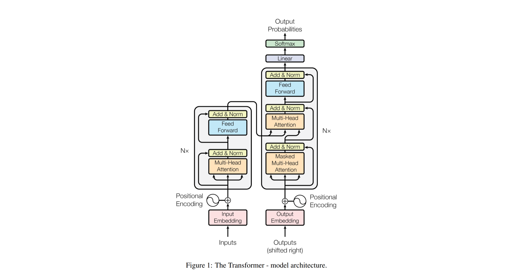
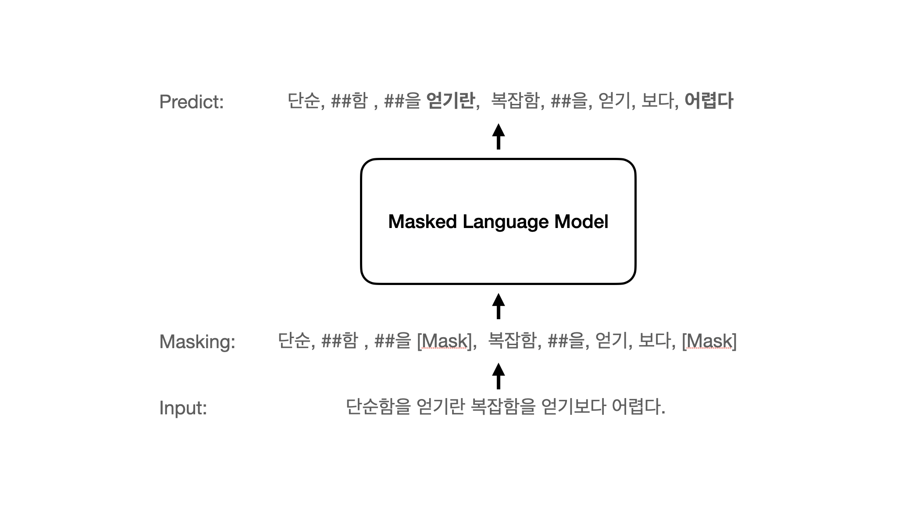
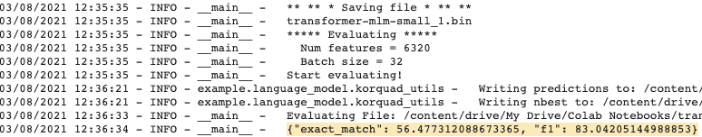
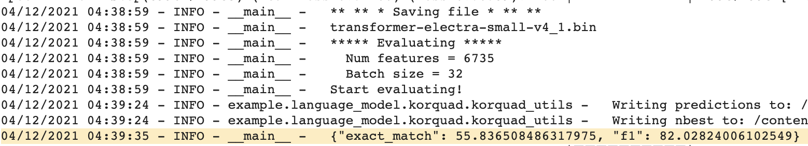
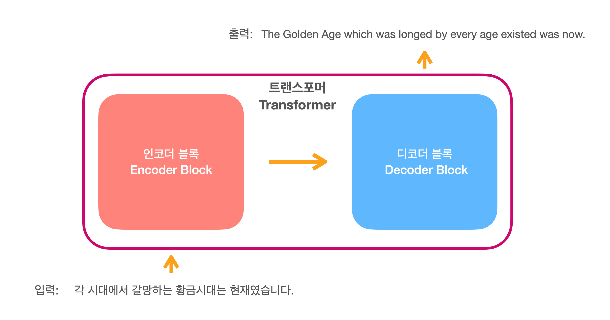

# Pytorch Transformer
직접 구현한 pytorch 트랜스포머를 이용한 언어모델(BERT MLM, ELECTRA)과 기계번역 테스트. 

## Model


```text
model
 ㄴ transformer.py    ﹒﹒﹒ Transformer 모델
 ㄴ electra.py        ﹒﹒﹒ ELECTRA 모델
 ㄴ util.py           ﹒﹒﹒ 모델에 사용되는 유틸
 ㄴ visualization.py  ﹒﹒﹒ 모델의 각 부분 시각화
example
 ㄴ language_model    ﹒﹒﹒ 언어모델 예제
 ㄴ translation       ﹒﹒﹒ 번역 예제
```

## Example
### 1. Masked Language Model(ex. BERT)
BERT에서 사용한 MLM을 이용한 언어모델 Pretraining 


### Usage
```txt
① 디렉토리 및 파일 코랩으로 이동 
② config/mlm 경로의 학습할 설정 확인 
③ Pretraining 할 Data와 Vocab 확인 
④ train-mlm.ipynb로 Pretraining 
⑤ Pretraining 완료 후 korquad-transformer-mlm.ipynb로 Korquad 학습 및 테스트 
```
#### Model Config
```
  "dim": 512,
  "depth": 6,
  "n_head": 8,
  "max_seq_len" : 512,
```
#### KorQuAD 1.0 
- epoch: 5



|            model         | exact_match | f1 score|
|:-------------------------|-------------|---------|
|           KoBERT         |    51.75    |  79.15  |
|**transformer-bert-small**|  **56.47**  |**83.04**|


### 2. ELECTRA
트랜스포머 인코더 블록을 이용한 ELECTRA Pretraining


#### Usage
```txt
① 디렉토리 및 파일 코랩으로 이동 
② config/electra 경로의 학습하기 위한 json 설정 확인 
③ Pretraining 할 Data와 Vocab 확인 
④ train-electra.ipynb에서 electra/run_pretraing.py를 이용해 Pretraining 
⑤ Pretraining 완료 후 korquad-transformer-electra.ipynb로 Korquad 학습 및 테스트 
```

#### Model Config
`ELECTRA-small` 모델 테스트
  
|                  |               | Layers | Embedding Size | Hidden Size | # heads |
| :--------------: | ------------: | -----: | -------------: | ----------: | ------: |
| `ELECTRA-small`  | Discriminator |     12 |            128 |         256 |      12 |
|                  |     Generator |     12 |            128 |         256 |       4 |

#### Training
##### ① Warm up
- torch.optim.lr_scheduler.StepLR: Generator가 충분히 수렴하지 못하는 경향.
- torch.optim.lr_scheduler.OneCycleLR: `5e-3` 까지 Warm up 후 learning rate 떨어지도록 학습. `5e-2` 동작 X

##### ② Amp
mixed precision을 사용해 학습 및 배치 사이즈 증가.  

#### KorQuAD 1.0 
- epoch: 5



|             model           | exact_match | f1 score|
|:----------------------------|-------------|---------|
|             KoBERT          |    51.75    |  79.15  |
|**transformer-electra-small**|  **55.83**  |**82.02**|

### 3. Ko-En Translation
AI Hub 번역 데이터를 이용한 한국어 -> 영어 번역 모델

#### Data
##### ① AI Hub Ko-En Translation Sample Data.
- data url: https://aihub.or.kr/sample_data_board
##### ② AI Hub Ko-En Translation Spoken Data
구어체 번역 데이터 사용.  
  
**csv format data**
```text
당신한테는 언제가 좋은가요?,When would be a good day for you?
당신한테서 답장이 오면 난 하루가 행복해요.,I feel happy all day long if I get your reply.
당신회사는 공장과 직접 일을 하나요?,Does your company work with the factory directly?
```
#### Train Setting
```python
# Model setting
model_name = 'transformer-translation-spoken'
vocab_num = 22000
max_length = 64
d_model = 512
head_num = 8
dropout = 0.1
N = 6
device = 'cuda:0' if torch.cuda.is_available() else 'cpu'

# Hyperparameter
epochs = 50
batch_size = 8
learning_rate = 0.8
```
#### Training 
`train_translation.py`으로 번역 모델 학습.  
```sh
python3 train_translation.py
```
#### Train Result
- Epoch: 50

```
-----------------------------------------------------------------------------------------
| end of epoch   0 | time: 2005.31s | valid loss  4.95 | valid ppl   141.70
-----------------------------------------------------------------------------------------
| end of epoch   1 | time: 2149.59s | valid loss  4.62 | valid ppl   101.26
-----------------------------------------------------------------------------------------
| end of epoch   2 | time: 2058.49s | valid loss  4.39 | valid ppl    80.86
-----------------------------------------------------------------------------------------
| end of epoch   3 | time: 1966.75s | valid loss  4.25 | valid ppl    70.38
-----------------------------------------------------------------------------------------
                                ...중략...
| end of epoch  47 | time: 1973.69s | valid loss  2.79 | valid ppl    16.26
-----------------------------------------------------------------------------------------
| end of epoch  48 | time: 2076.40s | valid loss  2.77 | valid ppl    16.00
-----------------------------------------------------------------------------------------
| end of epoch  49 | time: 2080.24s | valid loss  2.79 | valid ppl    16.26
-----------------------------------------------------------------------------------------
```

#### Ko-En Translation Test
-  10000 데이터 대비, 220000 데이터에서 더 좋은 성능
```text
ko: 나는 먹고 자기만 했어요. en: I just had a lot of things.
------------------------------------------------------
ko: 나는 먹기 위해 운동했어요. en: I exercised to eat.
------------------------------------------------------
ko: 나는 먹을 음식을 좀 샀습니다. en: I bought some food.
------------------------------------------------------
ko: 나는 아침으로 매일 토스트를 만들어 먹어. en: I eat breakfast every morning.
------------------------------------------------------
ko: 당신이 노래부르는 영상을 보고싶어요 en: I singing videos and watched the song.
------------------------------------------------------
ko: 대단히 미안하지만 오늘 회의가 있어서 수업에 늦을것 같아요. en: I'm sorry but I am sorry but I am sorry but I am sorry.
------------------------------------------------------
ko: 당신이 준 장미는 향기로워요. en: I'm very happy to see you.
------------------------------------------------------
ko: 당신이 제일 많이 생각하는 게 무엇인가요? en: What is the most important thing you think?
------------------------------------------------------
ko: 가정집을 개조한 분위기 좋은 레스토랑이 있습니다. en: There is a good restaurant to be a good restaurant.
------------------------------------------------------
ko: 가난뱅이인 제가 당신을 어떻게 사랑할 수 있습니까? en: How can I love you and love you?
```

## References
- http://nlp.seas.harvard.edu/2018/04/03/attention
- https://tutorials.pytorch.kr/beginner/transformer_tutorial.html
- https://github.com/lonePatient/electra_pytorch
- https://github.com/lucidrains/electra-pytorch