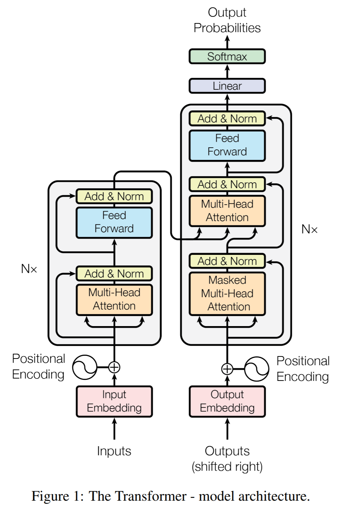

# Transformer
[The Annotated Transformer](http://nlp.seas.harvard.edu/2018/04/03/attention)와 [pytorch 공식문서](https://tutorials.pytorch.kr/beginner/transformer_tutorial.html)를 
참고하여 트랜스포머를 직접 개발해보고 한글-영어 번역 태스크에 대해 학습 및 테스트.

## Model
아래의 트랜스포머 모델의 구조에 따라 작성.


```text
model
 ㄴ transformer.py    ﹒﹒﹒ 트랜스포머 모델
 ㄴ util.py           ﹒﹒﹒ 모델에 사용되는 유틸
 ㄴ visualization.py  ﹒﹒﹒ 모델의 시각화에 사용하는 습
train_translation.py﹒﹒﹒ 한국어-영어 번역 학습
run_translation.py  ﹒﹒﹒ 한국어-영어 번역 테스트
```

## Ko-En Translation
AI Hub에 있는 한국어-영어 번역 데이터를 활용해 트랜스포머르 이용한 번역 태스크 학습

### Data
#### ① AI Hub 한국어-영어 번역 샘플 데이터.
> 샘플 데이터의 경우 회원 가입 및 로그인 할 필요 없음.
- url: https://aihub.or.kr/sample_data_board
#### ② AI Hub 한국어-영어 번역 데이터 - 구어체
다운로드 후 구어체 데이터데 대하여 학습.
**csv형태의 학습 데이터**
```text
당신한테는 언제가 좋은가요?,When would be a good day for you?
당신한테서 답장이 오면 난 하루가 행복해요.,I feel happy all day long if I get your reply.
당신회사는 공장과 직접 일을 하나요?,Does your company work with the factory directly?
```
### Train Setting
```python
# Model setting
model_name = 'transformer-translation-spoken'
vocab_num = 22000
max_length = 64
d_model = 512
head_num = 8
dropout = 0.1
N = 6
device = 'cuda:0' if torch.cuda.is_available() else 'cpu'

# Hyperparameter
epochs = 50
batch_size = 8
learning_rate = 0.8
```
### Training 
`train_translation.py`를 사용해 번역 학습. 
```sh
python3 train_translation.py
```
### Train Result
- Epoch: 50

```
-----------------------------------------------------------------------------------------
| end of epoch   0 | time: 2005.31s | valid loss  4.95 | valid ppl   141.70
-----------------------------------------------------------------------------------------
| end of epoch   1 | time: 2149.59s | valid loss  4.62 | valid ppl   101.26
-----------------------------------------------------------------------------------------
| end of epoch   2 | time: 2058.49s | valid loss  4.39 | valid ppl    80.86
-----------------------------------------------------------------------------------------
| end of epoch   3 | time: 1966.75s | valid loss  4.25 | valid ppl    70.38
-----------------------------------------------------------------------------------------
                                ...중략...
| end of epoch  47 | time: 1973.69s | valid loss  2.79 | valid ppl    16.26
-----------------------------------------------------------------------------------------
| end of epoch  48 | time: 2076.40s | valid loss  2.77 | valid ppl    16.00
-----------------------------------------------------------------------------------------
| end of epoch  49 | time: 2080.24s | valid loss  2.79 | valid ppl    16.26
-----------------------------------------------------------------------------------------
```

### Ko-En Translation Test
- 번역의 성능은 예상보다 뛰어나지는 않음.
- 학습데이터를 10000개, 220000개 정도로 나누어 학습했을때, 학습데이터가 많은 경우 수렴을 더 잘하게됨.
- 더 많은 데이터 및 언어모델로 추가 학습해본다면 개선 가능성.
```text
ko: 나는 먹고 자기만 했어요. en: I just had a lot of things.
------------------------------------------------------
ko: 나는 먹기 위해 운동했어요. en: I exercised to eat.
------------------------------------------------------
ko: 나는 먹을 음식을 좀 샀습니다. en: I bought some food.
------------------------------------------------------
ko: 나는 아침으로 매일 토스트를 만들어 먹어. en: I eat breakfast every morning.
------------------------------------------------------
ko: 당신이 노래부르는 영상을 보고싶어요 en: I singing videos and watched the song.
------------------------------------------------------
ko: 대단히 미안하지만 오늘 회의가 있어서 수업에 늦을것 같아요. en: I'm sorry but I am sorry but I am sorry but I am sorry.
------------------------------------------------------
ko: 당신이 준 장미는 향기로워요. en: I'm very happy to see you.
------------------------------------------------------
ko: 당신이 제일 많이 생각하는 게 무엇인가요? en: What is the most important thing you think?
------------------------------------------------------
ko: 가정집을 개조한 분위기 좋은 레스토랑이 있습니다. en: There is a good restaurant to be a good restaurant.
------------------------------------------------------
ko: 가난뱅이인 제가 당신을 어떻게 사랑할 수 있습니까? en: How can I love you and love you?
```


## Issue
### 1. encoder 마스킹 에러
mask에 unsqueeze(1)을 통해 하나의 차원을 추가필요.
```py
  mask = mask.unsqueeze(1)
  attention_score = attention_score.masked_fill(mask == 0, -1e9)
```
### 2. max_seq_len이 긴경우
```text
대부분의 문장이 짧게 구성되어 있다. 최초에 512 토근으로 지정후 학습하면, 시간도 느리고, pad 토큰에 대해 학습하여
성능이 좋지 않았다.
```

## References
- http://nlp.seas.harvard.edu/2018/04/03/attention